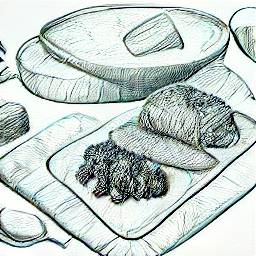

  <h1>Delicose</h1>
  
  
Modern AI driven shopping app that actually makes your life easier.

  
Image generated using <a href="https://huggingface.co/spaces/dalle-mini/dalle-mini">Hugging Face DALL-E mini</a>.

 

# Name origins

Delicose = word play on the word bellicose which means "belligerent", "eager to fight". It's supposed to "wage war on finding good food".

# Ideas

* All data offline, on mobile phone
* Allow user to add item to buy
* Allow user to specify where an item can be bought. What store.
* Allow user to find similar items
* Allow user to find luxury items / gourmet foods
* Allow user to look at store, which recommends items
* Record history of bought items?
* Record price of bought items?
